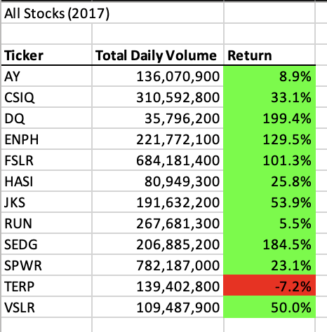
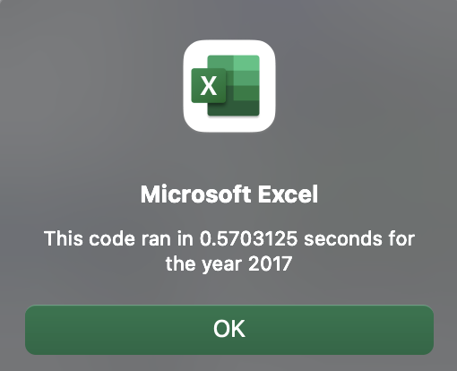
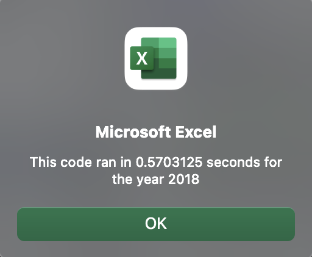
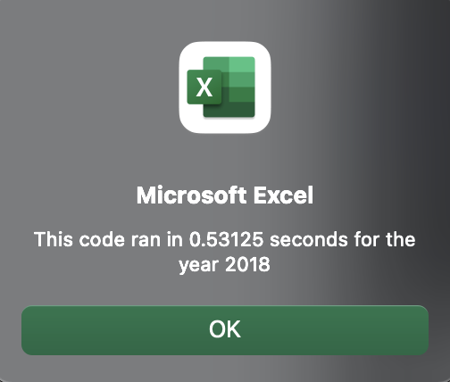

# stock-analysis
## Overview of Project
Using VBA to analyze 2017 and 2018 stock data.
### Purpose
In this project, 2017 and 2018 Stock Market Data was analyzed to create a VBA macro that can trigger pop-ups and inputs, read and change cell values, and format cells. Loops, nested for loops and conditionals were used to direct flow. Finally, the code was made more efficient by taking fewer steps, using less memory, and improving the logic of the code to find the total daily volume and yearly return for each stock in our dataset for 2017 and 2018. Coding skills were applied such as syntax recollection, pattern recognition, problem decomposition, and debugging.
## Results: 
Using images and examples of your code, compare the stock performance between 2017 and 2018, as well as the execution times of the original script and the refactored script.
### 2017 Stock Performance

### 2018 Stock Performance

### Execution time of the original script 2017

### Execution time of the refactored script 2017

### Execution time of the original script 2018

### Execution time of the refactored script 2018

## Summary: In a summary statement, address the following questions.
- What are the advantages or disadvantages of refactoring code?
- How do these pros and cons apply to refactoring the original VBA script?

#### Original Code
```VBScript
   '4) Loop through tickers
   For i = 0 To 11
       ticker = tickers(i)
       totalVolume = 0
       
    '5) loop through rows in the data
       Worksheets(yearValue).Activate
       For j = 2 To RowCount
     
     '5a) Get total volume for current ticker
          If Cells(j, 1).Value = ticker Then
            totalVolume = totalVolume + Cells(j, 8).Value
```

#### Refactored Code
```VBScript
    '1a) Create a ticker Index
    For i = 0 To 11
        tickerIndex = tickers(i)

    '1b) Create three output arrays
    Dim tickerVolumes As Long
    Dim tickerStartingPrices As Single
    Dim tickerEndingPrices As Single
    
    ''2a) Create a for loop to initialize the tickerVolumes to zero.
        Worksheets(yearValue).Activate
        tickerVolumes = 0
```
