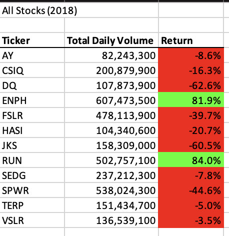

# stock-analysis
## Overview of Project
Using VBA to analyze 2017 and 2018 stock data.
### Purpose
In this project, 2017 and 2018 Stock Market Data was analyzed to create a VBA macro that can trigger pop-ups and inputs, read and change cell values, and format cells. Loops, nested for loops and conditionals were used to direct flow. Finally, the code was made more efficient by using less memory, and improving the logic of the code to find the total daily volume and yearly return for each stock in our dataset for 2017 and 2018. Coding skills were applied such as syntax recollection, pattern recognition, problem decomposition, and debugging.
## Results: 
### Original Code
In our original code the total volume was set to 0 after creating the for loop.
```VBScript
   '4) Loop through tickers
   For i = 0 To 11
       ticker = tickers(i)
       totalVolume = 0
       
    '5) loop through rows in the data
       Worksheets(yearValue).Activate
       For j = 2 To RowCount
     
     '5a) Get total volume for current ticker
          If Cells(j, 1).Value = ticker Then
            totalVolume = totalVolume + Cells(j, 8).Value
```
### Refactored Code
In our refactored code, after creating the three output arrays the ticker volumes were set to zero resulting in greater efficiency of the code.
```VBScript
    '1a) Create a for loop and ticker Index
    For i = 0 To 11
        tickerIndex = tickers(i)

    '1b) Create three output arrays
    Dim tickerVolumes As Long
    Dim tickerStartingPrices As Single
    Dim tickerEndingPrices As Single
    
    ''2a)  initialize the tickerVolumes to zero.
        Worksheets(yearValue).Activate
        tickerVolumes = 0
```
### Execution time of the original script 2017

### Execution time of the refactored script 2017

### Execution time of the original script 2018

### Execution time of the refactored script 2018

### 2017 Stock Performance

### 2018 Stock Performance


## Summary: In a summary statement, address the following questions.
- What are the advantages or disadvantages of refactoring code?
  - Advantages: Refactoring is a key part of the coding process. When refactoring code, you can make the code more efficient by taking fewer steps, using less memory, or improving the logic of the code to make it easier for future users to read. 
  - Disadvantages: Spending more time debugging. Unknown how long it will take to complete the process. May lead to a dead-end. You may run into a situation where you spend more time in solving the problem instead of just starting fresh with an outline.
- How do these pros and cons apply to refactoring the original VBA script?
  - Pros: 
  - Cons: 
