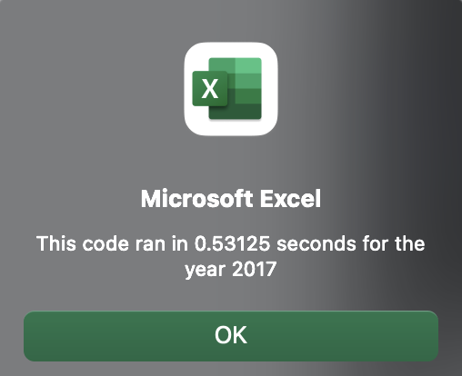

# stock-analysis
Using VBA
## Overview of Project
Analysis and visualization of Theater (N = 1369) and plays (n = 1047) fundrising campaign data.
### Purpose
The client's play "Fever" came close to reaching its fundraising goal in a short amount of time. Now, she wants to know how similar campaigns fared in relation to their launch dates and their funding goals. The purpose of this analysis is to create a visualization for different theater and plays campaigns based on launch dates and funding goals. Conclusions will be made based on the visualization of this dataset and suggestions offered for further analysis of data.
##Results: 
Using images and examples of your code, compare the stock performance between 2017 and 2018, as well as the execution times of the original script and the refactored script.
## Summary: In a summary statement, address the following questions.
- What are the advantages or disadvantages of refactoring code?
- How do these pros and cons apply to refactoring the original VBA script?



```VBA
'1a) Create a ticker Index
    For i = 0 To 11
        tickerIndex = tickers(i)
```
